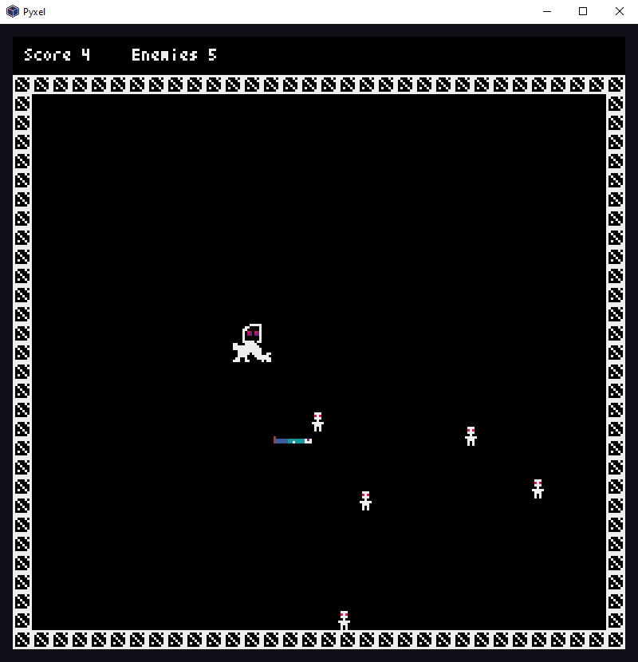

# MonsterGame

This rather useless game was used to learn the basics of _pyxel_.
to start the game install `pyxel`

```
pip install pyxel
py app.py
```

Only tested on windows.


# Screenshot



# Goal

1. Eat the corpses
2. Avoid the enemies
3. Get 10 points
4. No enemies == Game Over

# Controls

You can either use the arrow keys or WSAD to move the monster and eating corpses earns you points.

Press `ESC` to exit

# Credit

Based on the awesome python pixel game engine [kitao/pyxel](https://github.com/kitao/pyxel)